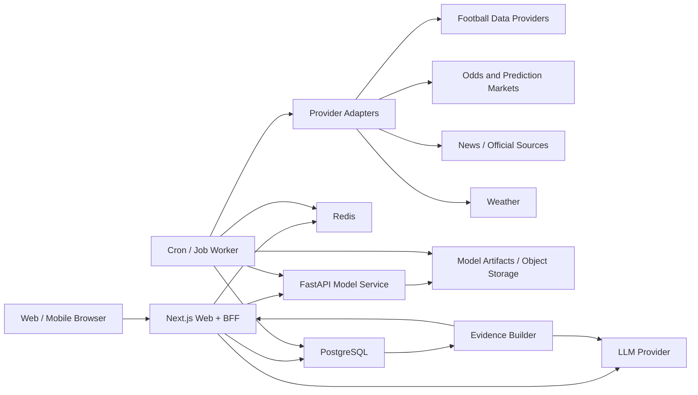
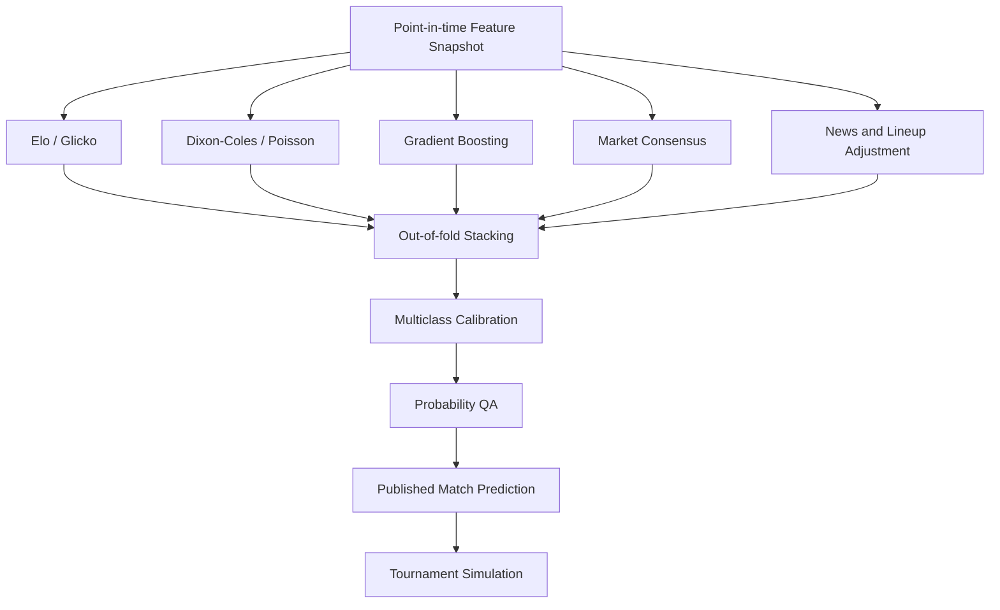

# World Cup Intelligence

中文名称：世界杯智能预测

状态：第一阶段系统设计  
更新时间：2026-06-12

## 1. 整体系统架构

采用 monorepo、模块化单体优先、独立 Python 模型服务的架构：



核心原则：

- `apps/web` 是用户产品、公开 API 和业务数据库写入的唯一入口。
- `apps/model-service` 是无状态 Python 计算服务，负责训练、预测、解释、评估和模拟，不拥有数据库迁移。
- `apps/worker` 负责数据摄取、特征快照、重新预测和定时任务。
- PostgreSQL 保存规范化业务数据、不可变历史快照和模型输出。
- Redis 用于短期缓存、分布式锁、限流和任务状态，不作为事实来源。
- 模型文件、大型训练快照和回测产物存放在 S3 兼容对象存储；本地开发使用文件系统或 MinIO。
- 外部数据不可用时返回最后一次成功快照，并明确标记数据陈旧程度。
- 首个可部署版本保持模块化单体。只有数据量、团队边界或负载证明必要时，才拆分更多服务。

## 2. 前端、后端、数据库和模型服务关系

### Next.js Web 与 BFF

- App Router + TypeScript strict mode。
- 页面使用 Server Components 获取首屏数据，交互区域使用 Client Components。
- TanStack Query 负责客户端重新验证、轮询和突变。
- `next-intl` 使用 `/en/...` 与 `/zh/...` 统一语言路由。
- BFF 校验请求、执行授权和限流、组合数据库数据、调用模型服务并持久化结果。
- 浏览器不直接访问数据库、模型服务或带密钥的第三方 API。

### FastAPI 模型服务

- 接收版本化、经过验证的 `FeatureSnapshot`。
- 返回多个基础模型和最终集成模型的概率、比分矩阵、解释和不确定性。
- 提供 Elo 更新、Dixon-Coles 拟合、滚动评估和世界杯模拟接口。
- 不读取页面状态，不直接抓取第三方数据，不直接修改业务表。
- 生产环境从对象存储加载只读模型制品；模型制品包含训练截止时间、代码版本、特征版本和指标。

### PostgreSQL 与 Prisma

- Prisma 是关系模式和迁移的唯一所有者。
- 业务服务通过 Prisma 读写。
- Python 训练数据由 worker 生成版本化 Parquet/JSON 快照后交给模型服务。
- 需要近实时预测时，BFF 或 worker 从数据库构造特征请求，模型服务返回结果，再由调用方写入数据库。

### Redis

- API 响应缓存和 stale-while-revalidate。
- 外部 Provider 请求缓存。
- 基于 IP、会话和 API key 的限流。
- 定时任务去重和分布式锁。
- 模拟任务进度与短期结果缓存。

## 3. 项目目录结构

```text
world-cup-intelligence/
├── apps/
│   ├── web/
│   │   ├── app/
│   │   │   ├── [locale]/
│   │   │   │   ├── page.tsx
│   │   │   │   ├── matches/
│   │   │   │   │   ├── page.tsx
│   │   │   │   │   └── [matchId]/page.tsx
│   │   │   │   ├── tournament/page.tsx
│   │   │   │   ├── groups/page.tsx
│   │   │   │   ├── bracket/page.tsx
│   │   │   │   ├── teams/
│   │   │   │   │   ├── page.tsx
│   │   │   │   │   └── [teamId]/page.tsx
│   │   │   │   ├── predictions/page.tsx
│   │   │   │   ├── markets/page.tsx
│   │   │   │   ├── model/page.tsx
│   │   │   │   ├── methodology/page.tsx
│   │   │   │   ├── backtest/page.tsx
│   │   │   │   ├── sources/page.tsx
│   │   │   │   ├── about/page.tsx
│   │   │   │   └── disclaimer/page.tsx
│   │   │   ├── api/v1/
│   │   │   └── health/
│   │   ├── components/
│   │   │   ├── charts/
│   │   │   ├── chat/
│   │   │   ├── matches/
│   │   │   ├── navigation/
│   │   │   ├── tournament/
│   │   │   └── ui/
│   │   ├── features/
│   │   ├── i18n/
│   │   ├── lib/
│   │   ├── messages/
│   │   │   ├── en.json
│   │   │   └── zh.json
│   │   └── tests/
│   ├── worker/
│   │   ├── src/
│   │   │   ├── jobs/
│   │   │   ├── orchestration/
│   │   │   └── schedules/
│   │   └── tests/
│   └── model-service/
│       ├── app/
│       │   ├── api/
│       │   ├── calibration/
│       │   ├── evaluation/
│       │   ├── explainability/
│       │   ├── features/
│       │   ├── models/
│       │   │   ├── elo.py
│       │   │   ├── poisson.py
│       │   │   ├── dixon_coles.py
│       │   │   ├── market_consensus.py
│       │   │   └── ensemble.py
│       │   ├── schemas/
│       │   ├── simulation/
│       │   └── settings.py
│       └── tests/
├── packages/
│   ├── contracts/
│   │   ├── src/api/
│   │   ├── src/domain/
│   │   └── openapi/
│   ├── database/
│   │   ├── prisma/schema.prisma
│   │   ├── prisma/migrations/
│   │   └── prisma/seed.ts
│   ├── providers/
│   │   ├── src/football/
│   │   ├── src/markets/
│   │   ├── src/news/
│   │   ├── src/social/
│   │   ├── src/weather/
│   │   └── src/mock/
│   ├── ui/
│   ├── i18n/
│   ├── observability/
│   ├── config-eslint/
│   └── config-typescript/
├── data/
│   ├── mock/
│   └── fixtures/
├── docs/
│   ├── architecture.md
│   ├── data-governance.md
│   ├── model-validation.md
│   └── deployment.md
├── research/
│   └── football_prediction_literature.md
├── scripts/
├── .env.example
├── docker-compose.yml
├── Dockerfile.web
├── Dockerfile.worker
├── Dockerfile.model
├── package.json
├── pnpm-workspace.yaml
├── turbo.json
└── README.md
```

## 4. 数据流与模型流

### 数据流

1. Provider adapter 获取带来源时间戳的原始数据。
2. 原始响应摘要和请求元数据写入 `ingestion_runs`，原始大对象可写入对象存储。
3. 规范化层完成球队/球员/赛事实体映射、单位转换、去重和质量校验。
4. 规范化记录写入 PostgreSQL，所有市场和新闻时间序列采用 append-only。
5. Feature builder 只查询 `available_at <= prediction_cutoff` 的数据。
6. 生成不可变 `feature_snapshots` 和 `source_snapshots`。
7. 模型服务计算基础模型、集成模型、校准结果、解释与不确定性。
8. worker 将预测写入 `model_predictions`，更新缓存并发布刷新事件。
9. 页面与聊天均读取同一预测版本，避免不同入口给出冲突概率。

### 模型流



发布前强制检查：

- 所有概率为有限数，且每组互斥结果之和在容差内等于 1。
- 输入数据的 `available_at` 不晚于预测截止时间。
- 模型版本、特征版本、训练截止时间和来源快照完整。
- 若市场、阵容或天气缺失，使用经过验证的降级路径并降低置信度。

## 5. 数据库表设计

所有 ID 使用 UUID；时间使用 UTC `timestamptz`；概率使用 `decimal` 或经过约束的双精度字段；可变来源载荷使用 JSONB，但核心查询字段必须规范化。

### 核心赛事

| 表 | 关键字段 | 说明 |
|---|---|---|
| `teams` | `id`, `fifa_code`, `country_code`, `name_en`, `name_zh`, `crest_url`, `is_national_team` | Logo 仅保存有许可的 URL；默认使用自制旗帜/文字标识 |
| `players` | `id`, `team_id`, `name`, `position`, `birth_date`, `club_name` | 球员主数据 |
| `venues` | `id`, `name_en`, `name_zh`, `city`, `country_code`, `latitude`, `longitude`, `altitude_m` | 场馆和环境 |
| `tournaments` | `id`, `name`, `season`, `format_version`, `starts_at`, `ends_at` | 赛制版本必须固定 |
| `groups` | `id`, `tournament_id`, `code`, `rules_json` | 小组及排名规则 |
| `tournament_teams` | `tournament_id`, `team_id`, `group_id`, `seed` | 参赛关系 |
| `matches` | `id`, `tournament_id`, `group_id`, `home_team_id`, `away_team_id`, `stage`, `kickoff_at`, `venue_id`, `status` | 比赛主表 |
| `match_results` | `match_id`, `home_goals_90`, `away_goals_90`, `extra_time`, `penalties`, `confirmed_at` | 正式赛果 |
| `lineups` | `id`, `match_id`, `team_id`, `status`, `announced_at`, `source_id` | 预计/确认首发分开保存 |
| `lineup_players` | `lineup_id`, `player_id`, `starter`, `position`, `expected_minutes` | 阵容成员 |
| `injuries` | `id`, `player_id`, `team_id`, `status`, `reported_at`, `available_at`, `confidence` | 保留信息可用时间 |

### 评级、特征和模型

| 表 | 关键字段 | 说明 |
|---|---|---|
| `team_ratings` | `team_id`, `rating_type`, `value`, `attack`, `defense`, `as_of`, `model_version_id` | Elo、Glicko、动态攻防 |
| `player_ratings` | `player_id`, `rating_type`, `value`, `uncertainty`, `as_of` | Plus-Minus 等 |
| `feature_snapshots` | `id`, `match_id`, `cutoff_at`, `schema_version`, `features_json`, `content_hash` | 不可变、可复现 |
| `source_snapshots` | `id`, `match_id`, `cutoff_at`, `sources_json`, `content_hash` | 数据来源证据 |
| `model_versions` | `id`, `name`, `family`, `semantic_version`, `git_sha`, `trained_through`, `artifact_uri`, `feature_schema_version`, `status` | 模型谱系 |
| `model_predictions` | `id`, `match_id`, `model_version_id`, `feature_snapshot_id`, `source_snapshot_id`, `generated_at`, `cutoff_at`, `home_win`, `draw`, `away_win`, `home_xg`, `away_xg`, `scorelines_json`, `advance_json`, `confidence`, `intervals_json`, `explanation_json` | 每条预测完整存档 |
| `model_metrics` | `id`, `model_version_id`, `scope`, `window_start`, `window_end`, `log_loss`, `brier`, `rps`, `ece`, `accuracy`, `precision_json`, `recall_json`, `f1_json`, `roi`, `clv`, `sample_size` | 分赛事类型和时间窗 |
| `backtest_runs` | `id`, `model_version_id`, `strategy`, `started_at`, `completed_at`, `config_json`, `result_uri` | 滚动回测 |

### 市场、新闻和来源

| 表 | 关键字段 | 说明 |
|---|---|---|
| `odds` | `id`, `match_id`, `provider_id`, `market_type`, `selection`, `decimal_odds`, `implied_probability`, `no_vig_probability`, `observed_at`, `available_at`, `is_opening`, `is_closing` | append-only 赔率 |
| `prediction_markets` | `id`, `match_id`, `provider_id`, `external_market_id`, `title`, `resolution_rules`, `status` | 市场定义 |
| `prediction_market_ticks` | `id`, `market_id`, `outcome`, `best_bid`, `best_ask`, `last_price`, `volume`, `liquidity`, `spread`, `observed_at` | 可成交市场快照 |
| `news_items` | `id`, `provider_id`, `url`, `title`, `body_excerpt`, `published_at`, `available_at`, `language`, `credibility`, `verification_status` | 新闻和官方公告 |
| `social_signals` | `id`, `provider_id`, `external_id`, `published_at`, `available_at`, `credibility`, `sentiment`, `entities_json`, `verification_status`, `content_hash` | 不将原文无限复制 |
| `data_sources` | `id`, `key`, `name`, `category`, `license_url`, `terms_url`, `priority`, `enabled` | 来源注册表 |
| `provider_entity_mappings` | `provider_id`, `entity_type`, `external_id`, `internal_id`, `confidence` | 解决不同 Provider ID |
| `ingestion_runs` | `id`, `provider_id`, `job_type`, `started_at`, `completed_at`, `status`, `records_read`, `records_written`, `error_summary`, `raw_artifact_uri` | 数据血缘与失败审计 |

### 模拟与聊天

| 表 | 关键字段 | 说明 |
|---|---|---|
| `simulations` | `id`, `tournament_id`, `model_version_id`, `prediction_cutoff`, `iterations`, `seed`, `scenario_json`, `result_json`, `created_by_session`, `created_at` | 官方与用户情景模拟 |
| `chat_sessions` | `id`, `locale`, `created_at`, `last_active_at`, `consent_version` | 匿名或账户会话 |
| `chat_messages` | `id`, `session_id`, `role`, `content`, `match_id`, `evidence_json`, `model_timestamp`, `created_at` | 保存证据和模型时间 |

### 关键约束和索引

- `home_win + draw + away_win = 1`，容差在应用层和数据库层双重校验。
- `home_team_id <> away_team_id`。
- `(match_id, model_version_id, cutoff_at)` 唯一，允许保存不同时间截面的预测。
- 市场时间序列索引：`(match_id, observed_at desc)`。
- 新闻查询索引：`(available_at, verification_status)`。
- 特征和来源快照以 `content_hash` 去重。
- 赛果确认后不覆盖旧预测。
- 任何训练查询必须使用 point-in-time join。

## 6. API 路由设计

公开 API 使用 `/api/v1`；内部模型 API 使用独立网络和 `/internal/v1`。

### 产品 API

| 方法 | 路由 | 用途 |
|---|---|---|
| `GET` | `/api/v1/dashboard` | 首页聚合数据 |
| `GET` | `/api/v1/matches` | 比赛列表、日期和赛事过滤 |
| `GET` | `/api/v1/matches/:id` | 比赛详情 |
| `GET` | `/api/v1/matches/:id/predictions` | 多模型预测对比 |
| `GET` | `/api/v1/matches/:id/markets` | 赔率和市场曲线 |
| `GET` | `/api/v1/matches/:id/explanations` | 特征贡献和证据 |
| `GET` | `/api/v1/teams` | 球队列表 |
| `GET` | `/api/v1/teams/:id` | 球队详情和评级历史 |
| `GET` | `/api/v1/tournaments/:id/groups` | 小组积分和出线概率 |
| `GET` | `/api/v1/tournaments/:id/bracket` | 淘汰赛树 |
| `GET` | `/api/v1/tournaments/:id/probabilities` | 各轮晋级和冠军概率 |
| `POST` | `/api/v1/simulations` | 创建异步模拟 |
| `GET` | `/api/v1/simulations/:id` | 获取进度和结果 |
| `GET` | `/api/v1/models` | 模型版本和方法 |
| `GET` | `/api/v1/models/:id/metrics` | 回测指标 |
| `GET` | `/api/v1/backtests` | 历史表现 |
| `GET` | `/api/v1/sources` | 来源、许可和更新时间 |
| `POST` | `/api/v1/chat` | AI 足球问答 |
| `GET` | `/api/v1/health` | 应用健康检查 |
| `GET` | `/api/v1/readiness` | DB、Redis、模型服务就绪状态 |

### Chat 契约

```ts
type ChatRequest = {
  language: "en" | "zh";
  message: string;
  matchId?: string;
  conversationHistory: Array<{
    role: "user" | "assistant";
    content: string;
  }>;
};

type ChatResponse = {
  answer: string;
  relatedMatches: Array<{
    id: string;
    homeTeam: string;
    awayTeam: string;
    kickoffAt: string;
  }>;
  sources: Array<{
    id: string;
    title: string;
    url?: string;
    sourceType: "fact" | "model" | "market" | "news";
    observedAt: string;
  }>;
  modelTimestamp: string;
  disclaimer: string;
};
```

### 内部模型 API

| 方法 | 路由 | 用途 |
|---|---|---|
| `POST` | `/internal/v1/predict` | 单场多模型预测 |
| `POST` | `/internal/v1/ratings/elo/update` | 批量更新 Elo |
| `POST` | `/internal/v1/models/dixon-coles/fit` | 训练比分模型 |
| `POST` | `/internal/v1/ensemble/fit` | 使用 OOF 预测训练融合器 |
| `POST` | `/internal/v1/calibration/fit` | 多分类校准 |
| `POST` | `/internal/v1/simulate` | 赛事模拟 |
| `POST` | `/internal/v1/evaluate` | 滚动样本外评估 |
| `GET` | `/internal/v1/health` | 模型服务健康检查 |

写接口使用幂等键；错误采用统一 problem-details 格式；外部请求使用指数退避、抖动和熔断。

## 7. 预测模型架构

### MVP 基础模型

1. **Elo 模型**
   - 比赛重要性、主场/地区优势和净胜球可配置。
   - 只用比赛发生后更新，保存每次评级变更。
   - 将 Elo 差映射为 1X2 概率时显式建模平局。

2. **Dixon-Coles / Poisson**
   - 动态进攻、防守和主场参数。
   - 时间衰减和低比分相关修正。
   - 输出完整比分矩阵、xG、1X2、大小球和双方进球概率。

3. **市场共识**
   - 十进制赔率转隐含概率。
   - 对互斥结果去除 overround。
   - 多家来源按时效、可靠度、流动性和可成交性加权。

4. **初始集成**
   - MVP 先使用由滚动验证确定的非负权重线性池。
   - 权重在训练窗口内通过 Log Loss/RPS 优化，不人工指定。

### 完整版模型

- 动态贝叶斯攻防状态空间。
- Bivariate/Zero-Inflated Generalized Poisson，仅在消融验证改善后启用。
- LightGBM、XGBoost 或 CatBoost，预测进球参数或市场残差。
- 球员级收缩 Plus-Minus 和预计出场时间聚合。
- 新闻/阵容修正模型以有上限的调整量作用于基础强度。
- OOF stacking 或 Bayesian Model Averaging。
- 多分类 calibration：multinomial logistic、temperature/beta calibration；isotonic 仅在样本量足够时使用。

### 不确定性和置信度

- 参数不确定性：bootstrap 或后验抽样。
- 数据不确定性：缺失率、来源新鲜度和来源冲突。
- 模型分歧：基础模型预测方差。
- 置信度是数据质量与模型一致性的说明，不等于获胜概率。

### 验证规范

- 使用 expanding-window 或 rolling-window 时间序列验证。
- 每个 fold 的特征、校准和集成权重都只使用该时点之前的数据。
- 世界杯、洲际杯、预选赛和友谊赛分别报告。
- 主要指标：Log Loss、RPS、Brier、ECE 和可靠性曲线。
- 辅助指标：Accuracy、Precision、Recall、F1、ROI 和 CLV。
- ROI 回测使用当时可成交价格、费用、滑点、限额和流动性。
- 所有历史预测不可覆盖，禁止用当前模型重写过去展示。

### 世界杯赛制引擎

- 赛制由 `format_version` 和规则配置驱动，不在模拟代码中写死某一届结构。
- 2026 世界杯按 48 队、12 个四队小组建模；24 个小组前两名和 8 个最佳第三名进入 32 强。
- 32 强对阵需要根据最佳第三名来源小组执行组合映射，不能沿用 2022 年固定 16 强入口。
- 小组同分规则、公平竞赛分、抽签、加时和点球均使用确定性规则模块和官方测试夹具。
- 每次模拟保存迭代数、随机种子、赛制版本、预测截止时间和模型版本。

## 8. 数据来源接入方案

Provider 统一接口：

```ts
interface DataProvider<TQuery, TRecord> {
  readonly key: string;
  readonly category: "football" | "odds" | "market" | "news" | "social" | "weather";
  healthCheck(): Promise<ProviderHealth>;
  fetch(query: TQuery, context: FetchContext): Promise<ProviderResult<TRecord>>;
  normalize(record: TRecord): NormalizedRecord[];
}
```

`ProviderResult` 必须包含来源、请求时间、数据原始时间、许可信息、缓存状态和错误；页面不得直接依赖某家 Provider 的响应结构。

### 推荐来源矩阵

| 来源 | 类型 | 成本分类 | 用途 | MVP |
|---|---|---:|---|---|
| Mock fixtures | 内置 | 免费 | 本地开发、测试、降级 | 必需 |
| football-data.org | 正式 API | 免费层/付费 | 赛程、赛果、基础赛事数据 | 可用 |
| StatsBomb Open Data | 开放数据 | 免费且需遵守署名条款 | 历史事件、xG 研究和测试 | 可用 |
| Open-Meteo | 正式 API | 免费层/商业方案 | 场馆天气、历史预报 | 可用 |
| FIFA 公开页面/资料 | 官方公开信息 | 许可需逐项确认 | 赛程、规则、排名核验 | 人工/授权导入 |
| World Football Elo | 公共评级站点 | 条款需确认 | Elo 对照基准 | 可选，不默认抓取 |
| API-Football | 商业 API | 免费层/付费 | 阵容、伤停、比赛统计 | 可选 |
| Sportmonks Football API | 商业 API | 付费 | 世界杯、阵容、赔率等增强数据 | 生产增强 |
| Polymarket | 官方 REST/WebSocket/SDK | 市场数据 API | 价格、订单簿、成交和流动性 | 市场 MVP |
| Kalshi | 官方 REST/WebSocket/FIX | 账户/地区规则适用 | 合规预测市场数据 | 可选 |
| Manifold | 官方 API/数据许可 | 免费/平台规则适用 | 社交预测市场对照 | 可选 |
| Betfair/Pinnacle/赔率聚合商 | 授权 API | 通常付费 | 交易所和博彩共识 | 生产增强 |
| 官方球队公告/RSS | 官方内容 | 免费，遵守条款 | 伤停、阵容确认 | MVP 可人工审核 |
| 新闻聚合 API | 商业/免费层 | 可选 | 专业媒体信息 | 完整版 |
| Reddit API | 官方 API | 条款适用 | 低权重舆情 | 完整版 |
| X API | 官方 API | 通常付费 | 官方账号和记者信息 | 完整版 |

### 新闻与社交信号治理

- 可信度层级：官方确认 > 多家高可信媒体交叉确认 > 单一可靠记者 > 未验证社交内容。
- 所有内容按 `available_at` 做时间衰减和 point-in-time 保存。
- 使用 URL、内容哈希和实体/事件聚类去重。
- 未验证内容只影响界面提示，默认不进入模型。
- 新闻调整量设硬上限，并展示原始概率与调整后概率。
- 外部文本视为不可信数据，禁止其中的指令影响 AI 系统行为。

## 9. AI 对话框 RAG 设计

聊天不是开放式足球百科，而是“结构化数据优先、文本证据辅助”的受约束 RAG。

### 查询流程

1. 语言识别和意图分类：比赛预测、原因、晋级、爆冷、市场分歧、球员缺阵、今日比赛。
2. 实体解析：球队、球员、赛事、比赛和时间范围；歧义时只询问必要问题。
3. 权限与时间检查：只读取允许展示的数据。
4. 结构化检索：
   - 当前发布预测和基础模型分解。
   - 比赛、评级、阵容、伤停、天气和市场快照。
   - 最新模拟和模型指标。
5. 文本检索：
   - 仅检索已入库、带来源、时间和可信度的新闻。
   - MVP 使用 PostgreSQL 全文搜索；规模扩大后可启用 `pgvector` 混合检索。
6. Evidence Builder 将材料严格分成：
   - `facts`：赛程、已确认阵容、赛果。
   - `model_predictions`：概率、解释、不确定性。
   - `market_views`：价格、流动性、时间。
   - `unverified_reports`：明确降权和标识。
7. LLM 根据证据生成双语答案，句子级关联来源 ID。
8. 输出验证器检查概率、时间戳、免责声明和禁止表述。
9. 无 LLM key 或服务故障时，使用模板化答案返回核心预测，不让聊天完全失效。

### 安全与质量

- 不把检索文本放入系统指令区域。
- 忽略新闻、网页或用户文本中的工具调用和越权指令。
- 不生成“确定获胜”“稳赚”“保证盈利”等表达。
- 每条回答显示模型更新时间和数据新鲜度。
- 对市场问题区分模型公平概率、市场中间价和真实可成交价。
- 会话历史做长度限制、PII 最小化和保留期控制。
- 记录所用证据，不记录模型隐藏推理。

## 10. MVP 与完整版本边界

### MVP

- `/en` 与 `/zh` 双语页面、深浅主题、响应式导航。
- 首页、比赛列表、比赛详情、球队、小组、淘汰赛、模型、来源和免责声明。
- Mock 世界杯数据及可替换的 football-data/Open-Meteo Provider。
- Elo、Dixon-Coles/Poisson、市场 Mock 共识和滚动验证权重集成。
- 50,000 次以上完整赛事模拟，支持用户修改结果或实力。
- 多模型 1X2、xG、前五比分、32 强及后续晋级概率和基础解释。
- 模型指标与校准图。
- Polymarket 官方 API adapter；无对应足球市场时正常显示“暂无市场”。
- 基于数据库的聊天与模板化降级。
- PostgreSQL、Redis、健康检查、日志、限流、测试和 Docker。

### 完整版本

- 付费比赛数据、实时阵容、伤停、事件级 xG 和球员级评级。
- 授权博彩共识、Betfair/Kalshi/Manifold 等更多市场。
- 订单簿级可成交回测、CLV、容量和风险预算。
- 动态贝叶斯、梯度提升、OOF stacking、SHAP 和分层校准。
- 新闻/社交实体识别、可信度和交叉验证流水线。
- 用户账户、保存/分享模拟、通知和个性化时区。
- 管理后台、数据质量告警、模型审批和可回滚发布。
- 多地区部署、任务队列水平扩展和对象存储。

明确不属于 MVP：

- 自动下注或自动交易。
- 未授权媒体全文抓取。
- 声称实时但没有数据 SLA 的“伪实时”功能。
- 用少量世界杯比赛宣称异常高准确率。

## 11. 分阶段开发计划

### 第一阶段：设计

- 完成本架构、数据流、模型流、Provider 矩阵和风险登记。
- 固化 API 契约与 point-in-time 数据规则。
- Gate：设计一致性检查和文献依据检查。

### 第二阶段：产品骨架

- 创建 pnpm/Turborepo。
- Next.js、Tailwind、组件系统、next-intl 和主题。
- Prisma Schema、PostgreSQL/Redis、Mock Provider 和 seed。
- 首页、比赛列表、详情页及响应式布局。
- Gate：lint、TypeScript、单元测试、生产构建全部通过。

### 第三阶段：预测与模拟

- FastAPI、Elo、Poisson/Dixon-Coles、比分矩阵和集成接口。
- 世界杯规则引擎及 Monte Carlo。
- 指标、滚动验证和模型版本存档。
- Gate：Python lint/type/test、概率性质测试、前端构建全部通过。

### 第四阶段：外部数据与 AI

- football-data、Open-Meteo、Polymarket adapters。
- Provider 缓存、重试、熔断、定时更新和失败降级。
- 结构化 RAG 聊天、证据引用和模板化 fallback。
- Gate：契约测试、故障注入测试、无密钥本地运行通过。

### 第五阶段：部署与收尾

- 完成回测页、来源页、合规说明和可观测性。
- Docker、compose、CI、seed、README 和部署文档。
- Vercel 部署 Web；Railway/Fly.io/Render 部署 worker、模型和数据库，或全套容器部署。
- Gate：全新环境安装、lint、类型检查、全部测试和生产构建通过。

## 12. 主要风险与解决方案

| 风险 | 后果 | 解决方案 |
|---|---|---|
| 数据授权和 Logo 版权 | 下架或法律风险 | Provider 注册表记录许可；默认使用国旗、文字和自制图形；付费数据不进入公开仓库 |
| 2026 世界杯赛制/排名规则实现错误 | 晋级概率错误 | 赛制版本化；覆盖 12 组、最佳第三名、32 强组合映射和同分规则的官方规则测试夹具与性质测试 |
| 未来数据泄漏 | 回测虚高 | `available_at`、不可变快照、point-in-time join、fold 内特征/校准/融合 |
| 世界杯样本量小 | 过拟合和校准不稳 | 使用国际比赛扩充、分层收缩、简单基线、赛事留出和 bootstrap |
| 市场概率误用 | 虚假交易优势 | 去水位、记录买卖价和深度、成本/滑点、禁止用收盘价替代早期价格 |
| 外部 API 失败或限流 | 页面空白、任务堆积 | Redis 缓存、stale 数据、熔断、重试、Provider 优先级和 Mock fallback |
| 实体 ID 不一致 | 错配球队或比赛 | Provider mapping 表、FIFA code、人工审核队列和置信度 |
| 新闻与社交谣言 | 模型被噪声操纵 | 可信度、交叉确认、时间衰减、调整上限、未验证内容不入模 |
| AI 幻觉或混淆事实/预测 | 用户误解 | 证据包分区、结构化输出、来源和时间戳、确定性语言过滤 |
| 模拟性能 | 请求超时 | NumPy 向量化、异步任务、固定种子、缓存常用场景、进度轮询 |
| 双语内容不完整 | 体验不一致 | 所有 UI key 编译检查；实体双语字段；日期数字用 locale 格式化 |
| 双 ORM/迁移漂移 | 数据损坏 | Prisma 独占迁移；Python 纯计算；版本化 DTO 和 OpenAPI 契约 |
| 模型更新导致历史变化 | 无法审计 | 模型和预测不可变；发布指针指向当前版本；支持回滚 |
| 博彩合规和地区限制 | 合规风险 | 年龄/地区提醒、仅信息展示、不自动交易、市场 Provider 按地区开关 |

## 13. 关键技术选择

- **方案 A：Next.js BFF + FastAPI**，而不是两个都直接拥有业务数据库。
- **pnpm + Turborepo** 管理 TypeScript workspace 和跨应用任务。
- **PostgreSQL + Prisma** 提供强关系约束、JSONB 快照和成熟迁移。
- **Redis** 只承担可丢失的缓存、限流和协调状态。
- **Recharts** 优先用于 MVP；复杂淘汰树和桑基图再引入 ECharts，避免首包同时包含两套图库。
- **shadcn/ui 思路的本地组件**，保留可访问性与可控样式，不绑定远端运行时。
- **FastAPI + NumPy/pandas/scikit-learn/statsmodels** 完成 MVP；LightGBM/XGBoost/SHAP 延后到有验证数据时加入。
- **OpenAPI/JSON Schema 契约** 连接 TypeScript 与 Python，避免手写结构漂移。
- **OpenTelemetry 风格结构化日志**，生产环境可接 Sentry、Grafana 或云平台。

## 14. 外部 API 配置

预计环境变量：

```text
DATABASE_URL
REDIS_URL
MODEL_SERVICE_URL
MODEL_SERVICE_TOKEN
OBJECT_STORAGE_ENDPOINT
OBJECT_STORAGE_BUCKET
OBJECT_STORAGE_ACCESS_KEY
OBJECT_STORAGE_SECRET_KEY
FOOTBALL_DATA_API_KEY
API_FOOTBALL_API_KEY
SPORTMONKS_API_TOKEN
POLYMARKET_API_BASE_URL
KALSHI_API_KEY_ID
KALSHI_PRIVATE_KEY
MANIFOLD_API_KEY
OPEN_METEO_BASE_URL
NEWS_API_KEY
REDDIT_CLIENT_ID
REDDIT_CLIENT_SECRET
X_API_BEARER_TOKEN
LLM_API_KEY
```

除 `DATABASE_URL` 等本地基础设施变量外，所有第三方 key 均为可选。缺少 key 时 adapter 必须返回受控的 `unavailable` 状态并使用 Mock 或最后成功数据。

## 15. 已核验的官方接入资料

- Polymarket 官方文档提供市场数据、价格/订单簿、REST、WebSocket 及 SDK：https://docs.polymarket.com/
- Kalshi 官方文档提供 Predictions REST、WebSocket、FIX 和 demo 环境：https://docs.kalshi.com/
- Manifold 官方文档列出 API 和数据许可资料：https://docs.manifold.markets/
- football-data.org v4 文档提供比赛、球队、赛事等资源：https://www.football-data.org/documentation/quickstart
- Sportmonks Football API v3 包含世界杯 2026 指南、赔率和赛事端点：https://docs.sportmonks.com/v3
- StatsBomb Open Data 提供部分赛事的比赛、事件、阵容和部分 360 数据，并要求遵守署名条款：https://github.com/statsbomb/open-data
- Open-Meteo 提供全球预报、历史天气和多种气象变量：https://open-meteo.com/en/docs

接入前仍需复核每个 Provider 在目标部署地区、商业用途和缓存/再分发方面的最新条款。
